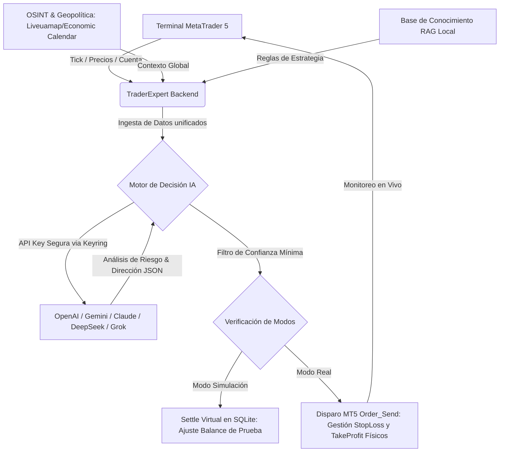
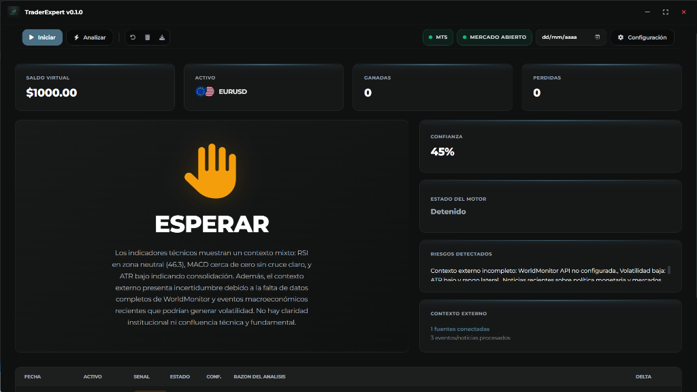
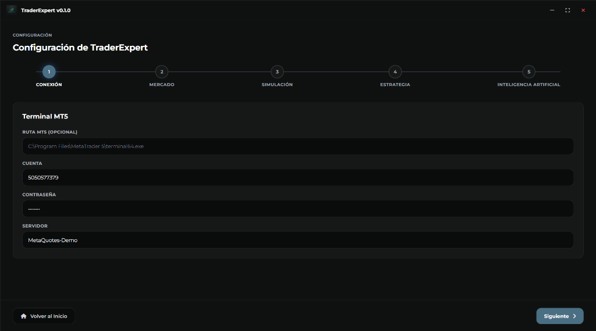
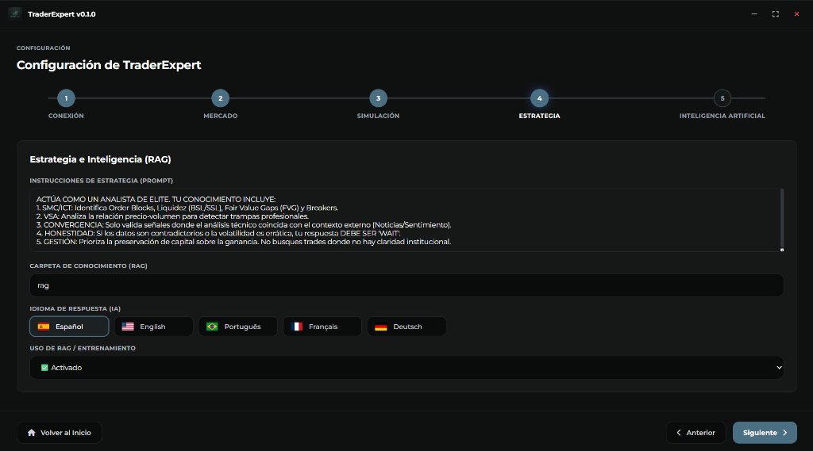
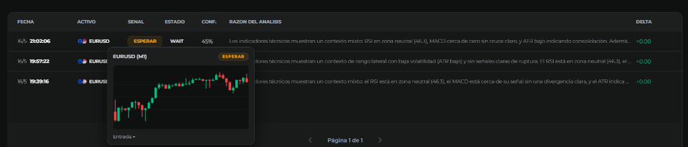

<p align="center">
  
</p>

<h1 align="center">TraderExpert</h1>

<p align="center">
  <strong>El nexo definitivo entre análisis institucional con IA Multimodelo y ejecución algorítmica nativa en tiempo real.</strong>
</p>

<p align="center">
  
  
  
  
</p>

---

## 🌐 Resumen del Sistema

**TraderExpert** es una aplicación de escritorio diseñada para traders institucionales y algorítmicos. Integra indicadores técnicos puros de volumen y acción de precio con el análisis cognitivo de múltiples modelos avanzados de Inteligencia Artificial (OpenAI, DeepSeek, Gemini, Claude, Grok y Azure OpenAI). 

La plataforma recopila información en tiempo real del terminal **MetaTrader 5**, consulta fuentes OSINT externas para verificar riesgos macroeconómicos y geopolíticos, alimenta un motor RAG con directrices de riesgo corporativas y ejecuta operaciones directamente en la cuenta de corretaje (Demo o Real) con salvaguardas automáticas contra desconexiones y mercados cerrados.

---

## 🛠️ Stack Tecnológico

<p align="center">
  <a href="https://www.python.org/">
    
  </a>
  <a href="https://openai.com/">
    
  </a>
  <a href="https://www.metatrader5.com/">
    
  </a>
  <br/>
  <a href="https://pywebview.flowrl.com/">
    
  </a>
  <a href="https://sqlite.org/">
    
  </a>
  <a href="https://github.com/jaraco/keyring">
    
  </a>
</p>

---

## 📐 Arquitectura & Flujo de Operación

El siguiente diagrama detalla cómo fluyen los datos a través del sistema, desde la recolección inicial del mercado hasta la toma de decisiones cognitivas de la IA y su posterior ejecución física.



---

## 💎 Características Clave

### 1. Conectividad Nativa MetaTrader 5 (MT5)
- **Modos Flexibles**: Permite alternar instantáneamente entre el **Modo Simulación** (operaciones virtuales almacenadas en la base de datos local) y el **Modo Real** (órdenes físicas y liquidación a través del terminal MT5).
- **Sincronización en Tiempo Real**: El panel principal recupera balances de cuenta, equidades vivas, nombre del servidor del bróker e insignias de estado (DEMO / REAL) directamente desde el terminal.
- **Protección de Mercado**: Impide el análisis cognitivo y las ejecuciones automáticas si la terminal MT5 se desconecta o si el mercado de activos está cerrado.
- **Liquidación Automatizada**: Cierre de posiciones inmediato a precio de mercado sobre los tickets correspondientes al cumplirse el horizonte de predicción.

### 2. Puerta de Enlace IA Multimodelo con Credenciales Seguras
- **Soporte Global**: Compatible con OpenAI (GPT-4o), Claude 3.5 Sonnet, DeepSeek R1, Gemini 1.5 Pro, Grok 2 y Azure OpenAI.
- **Formularios Dinámicos Modernos**: La interfaz de configuración presenta tarjetas e inputs interactivos específicos para cada proveedor, incluyendo multiselección de modelos nativos y visualización elegante.
- **Seguridad Absoluta (Keyring)**: Las claves de API de los proveedores de IA y la contraseña del terminal MT5 se almacenan de forma cifrada en el **Windows Credential Manager** utilizando la biblioteca nativa `keyring`, previniendo fugas en archivos de texto plano.

### 3. Motor RAG & OSINT Enriquecido
- **Estrategia RAG**: Carga de documentos de texto locales en una carpeta de conocimiento para contextualizar a la IA bajo reglas operativas de tu propia mesa de dinero.
- **Validación OSINT**: Recopilación automatizada de eventos geopolíticos en tiempo real y calendarios macroeconómicos para penalizar confianza ante volatilidad inminente.

---

## 📸 Capturas de Pantalla (Visual Overview)

### 1. Panel de Control (Dashboard Principal)
Visualización integral del saldo (simulado o real), equidad, estado del motor de decisión ("ESPERAR"), confianza algorítmica, riesgos geopolíticos/OSINT detectados e insignias dinámicas de conexión del bróker MT5 y estado de mercado.
<p align="center">
  
</p>

### 2. Configuración - Conexión Broker MT5 (Paso 1)
Acceso y enlace seguro al terminal MetaTrader 5 con credenciales encriptadas en el almacén seguro del sistema operativo (Windows Credential Manager).
<p align="center">
  
</p>

### 3. Configuración - Parámetros de Estrategia & RAG (Paso 4)
Definición de prompts institucionales de estrategia, habilitación de base de conocimiento RAG local y selección instantánea del idioma de respuesta de la IA.
<p align="center">
  
</p>

### 4. Gráfico e Historial Integrado con Tooltips Interactivos
Visualización histórica de análisis con mini-gráficos de velas en tooltips flotantes que muestran dinámicamente los niveles exactos de entrada y salida calculados.
<p align="center">
  
</p>

---

## 🚀 Instalación y Despliegue

### Requisitos Previos
- **Windows 10 / 11**
- **Python 3.11** o superior instalado en el PATH.
- **Terminal MetaTrader 5** instalado y con la opción "Permitir Trading Algorítmico" habilitada en la pestaña *Herramientas > Opciones > Asesores Expertos*.

### Proceso de Configuración

1. **Clonar el Repositorio e Inicializar el Entorno**:
   ```bash
   # Clonar el proyecto
   git clone https://github.com/tu-usuario/traderexpert.git
   cd TraderExpert

   # Crear y activar entorno virtual
   python -m venv .venv
   .venv\Scripts\activate
   ```

2. **Instalar Dependencias**:
   ```bash
   pip install -r requirements.txt
   ```

3. **Ejecutar la Aplicación**:
   ```bash
   python main.py
   ```

---

## 🔒 Variables de Entorno & Configuración Avanzada

Si prefieres omitir la configuración gráfica por defecto o proveer claves directamente desde entornos de desarrollo continuos (CI/CD), puedes configurar un archivo `.env` en la raíz del proyecto:

```env
# Claves de IA (Opcionales si se configuran desde la UI con Keyring)
OPENAI_API_KEY=sk-proj-...
AZURE_API_KEY=...
DEEPSEEK_API_KEY=...
CLAUDE_API_KEY=...
GEMINI_API_KEY=...

# Fuentes de Datos OSINT y Eventos Macro
WORLD_MONITOR_API_KEY=wm_live_...
ECONOMIC_CALENDAR_API_URL=https://tu-proveedor-autorizado.example/calendar
LIVEUAMAP_URL=https://liveuamap.com/
INVESTING_CALENDAR_URL=https://www.investing.com/economic-calendar
```

---

## 📄 Licencia y Descargo de Responsabilidad

Este software ha sido diseñado con propósitos educativos y de asistencia operativa de trading institucional. La operación en mercados financieros reales conlleva altos riesgos de pérdida de capital. Los autores y desarrolladores de **TraderExpert** no se hacen responsables de pérdidas financieras directas o indirectas resultantes del uso del software en **Modo Real**. Use y configure sus salvaguardas (StopLoss / Lotes mínimos) con total discreción.
